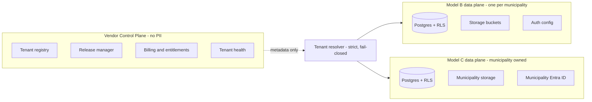

# UBM Klar — Architecture Overview

UBM Klar is a private municipal readiness, payment-control, evidence, and export-preparation
platform for Swedish municipalities. It is **not** an official service of Utbetalningsmyndigheten
or any other authority.

## Two UBM phases

| Phase | Effective | Mode |
| --- | --- | --- |
| Phase 1 | 1 July 2026 | Request-based: intake, matching, eligibility, review, maker-checker, export package, receipt, evidence chain |
| Phase 2 | 1 July 2029 | Recurring reporting: schedules, periods, dataset definitions, diffs, closure. Feature-flagged (`ubm_recurring_reporting_2029`) until official specifications exist. No final UBM schema is hardcoded. |

## Planes

### Control plane (vendor)

Stores tenant metadata, domains, environments, modules, licenses, release/migration status,
technical health, no-PII support tickets, feature flags, readiness gate status, billing.
**Never** stores personal identity numbers, names, decisions, incomes, households, bank
accounts, documents, UBM payloads, case content, or PII-bearing prompts/embeddings. Every
write goes through `assertNoPii` from `@ubm-klar/config`.

### Data planes (municipal)

Production is always an isolated data plane per municipality:

- **Model B — vendor-hosted isolated:** one Supabase project per municipality, separate
  Postgres, Auth, Storage, Edge Functions, RLS, API keys, backups, and test/stage/prod
  environments. Operated by the vendor; no PII crosses into the control plane.
- **Model C — municipality-owned:**
  - **C1:** municipality-owned managed Supabase
  - **C2:** self-hosted Supabase
  - **C3:** plain Postgres + separate storage + vendor backend
  The municipality owns database, storage, keys, audit logs, backups, and UBM export
  packages. The vendor delivers code, release packages, SQL migrations, rule templates,
  schema versions, and support.

A shared database is permitted **only** for local development, demo, fake data, and
non-production prototypes (`local_demo_shared` deployment mode, which can never pass the
production readiness gates).

## Monorepo

- `apps/web` — Next.js municipal UI (Swedish, role-based navigation)
- `apps/api` — Fastify backend for all sensitive operations (service-role keys live here only)
- `apps/worker` — background job families (import, data quality, rules, reconciliation, export, retention, ...)
- `apps/control-plane` — no-PII vendor control plane service
- `packages/*` — domain engines and shared libraries (all strict TypeScript, Vitest-tested)
- `supabase/migrations` — the per-municipality data plane schema, applied per tenant per environment
- `deployments/` — Model B / Model C deployment assets and runbooks
- `releases/` — signed release packages with migration manifests and rollback plans

## Versioning guarantees

Every UBM assessment, export proposal, control case and payment-control risk flag records
the legal source version, schema version, and rule version that produced it. Registries use
the lifecycle statuses `draft`, `proposed`, `pilot`, `active`, `deprecated`, `superseded`,
`requires_manual_review`, `awaiting_official_specification`.
